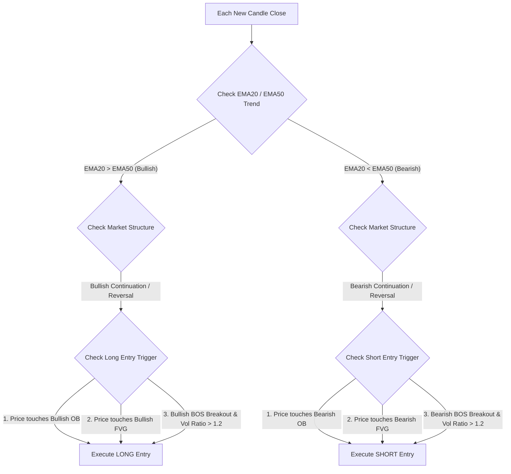

# Logic Baseline - Rule-Based Trading Bot (Detailed Technical Specification)

This document presents the detailed architectural design, technical analysis algorithms (SMC, Wyckoff, Price Action), scalping entry/exit rules, and simulation processes of the deterministic rule-based Baseline Bot (`scripts/run_baseline.py`).

---

## 1. Architecture Overview & System Role

The Baseline Bot is a **fully deterministic, rule-based trading program**. Instead of utilizing a Large Language Model (LLM) to make trading decisions based on qualitative evaluation as described in [LogicAI.md](LogicAI.md), this bot evaluates market structures using fixed mathematical and logical criteria written in Python.

### Role of the Baseline Bot:
1.  **Experimental Control (Baseline Model)**: Establishes a technical analysis baseline to benchmark the LLM agent's performance under identical market feeds, slippage, and transaction fee parameters.
2.  **Performance Optimization**: Runs entirely locally without API call overheads, facilitating rapid backtesting execution.
3.  **Synchronous Simulation**: Reuses 100% of the backtesting infrastructure from [backtest.py](backtest.py), including the intrabar TP/SL settlement models, transaction fee logs, and portfolio performance calculations.

---

## 2. Technical Patterns & Market Structure Detections

The Baseline Bot encodes principles of **Smart Money Concepts (SMC)**, **Wyckoff theory**, and **Price Action** into Python logic via four core algorithms:

### A. Price Action Candlestick Patterns (`detect_candlestick_patterns`)
Scans the last two completed candles to identify reversal or continuation candlestick setups:
*   **Pinbar (Hammer / Shooting Star)**: Characterized by a small body ($\le 35\%$ of total candle range) and a long upper or lower shadow ($\ge 60\%$ of total range).
    *   *Bullish Pinbar*: Long lower shadow (indicates buying pressure).
    *   *Bearish Pinbar*: Long upper shadow (indicates selling pressure).
*   **Engulfing Candle**: The body of the current candle completely covers the body of the previous candle and closes in the opposite direction.
*   **Inside Bar**: The High-Low range of the current candle is completely nested within the High-Low range of the preceding candle, indicating consolidation before breakout.

### B. Fair Value Gap Detection (`detect_fvgs`)
**Fair Value Gaps (FVGs)** represent price imbalances between supply and demand created by rapid, one-sided impulsive movements:
*   **Bullish FVG**: Occurs when the Low of candle 3 is greater than the High of candle 1. The price gap boundaries are defined from $\text{High}_{t-2}$ to $\text{Low}_{t}$.
*   **Bearish FVG**: Occurs when the High of candle 3 is less than the Low of candle 1. The price gap boundaries are defined from $\text{Low}_{t-2}$ to $\text{High}_{t}$.
*   **Mitigation**: An FVG remains active (*unmitigated*) until subsequent candles close inside and fill the gap range.

### C. Order Block Identification (`detect_order_blocks`)
An **Order Block (OB)** represents institutional order clustering. A Bullish OB is the final down-candle prior to an upward impulse, while a Bearish OB is the final up-candle prior to a downward impulse:
1.  **Displacement Detection**: An impulsive move is identified when the body size of a candle exceeds $1.5 \times$ the average body size of the last 20 candles.
2.  **OB Boundary Definition**:
    *   *Bullish OB*: The range (High-Low) of the last bearish candle preceding the upward impulse. This range is marked as a **Demand Zone**.
    *   *Bearish OB*: The range (High-Low) of the last bullish candle preceding the downward impulse. This range is marked as a **Supply Zone**.
3.  **Mitigation**: An OB is invalidated (mitigated) once a subsequent candle closes outside the OB boundaries.

### D. Market Structure Mapping (`detect_market_structure`)
Identifies Swing High and Swing Low points in the last 20 bars:
*   **Swing High**: A local maximum bar flanked by two lower highs on both the left and right sides.
*   **Swing Low**: A local minimum bar flanked by two higher lows on both the left and right sides.

**BOS / CHoCH Identification**:
*   **BOS (Break of Structure)**: Price closes above the recent Swing High (in an uptrend) or below the recent Swing Low (in a downtrend), signaling trend continuation.
*   **CHoCH (Change of Character)**: Price closes beyond the opposing Swing Point of the current trend, signaling a structural market reversal.
*   **Backward Scan Logic**: To prevent missing signals during trading ranges, the algorithm scans backward from the current candle to find the most recent BOS/CHoCH setup, ensuring accurate mapping of structural bias (`Bullish/Bearish Continuation` or `Reversal`).

---

## 3. Scalping Entry Logic

To optimize for shorter-term trades, entry rules bypass restrictive candlestick confirmations. The bot enters trades directly upon touching OB/FVG zones or catching breakouts:

### A. Long Entry (Buy) Rules
*   **Trend Filter**: EMA20 is above EMA50 ($\text{EMA20} > \text{EMA50}$) **AND** the market structure is mapped as `Bullish Continuation` or `Bullish Reversal`.
*   **Entry Trigger (Any of the following)**:
    1.  *OB Mitigation*: The current price dips and touches the boundaries of an unmitigated Bullish OB ($\text{OB Low} \le \text{Price} \le \text{OB High}$).
    2.  *FVG Mitigation*: The current price dips and touches the boundaries of an unmitigated Bullish FVG ($\text{FVG Low} \le \text{Price} \le \text{FVG High}$).
    3.  *BOS Breakout*: Price breaks and closes above the recent Swing High, accompanied by volume expansion ($\text{Volume Ratio} > 1.2$).

### B. Short Entry (Sell) Rules
*   **Trend Filter**: EMA20 is below EMA50 ($\text{EMA20} < \text{EMA50}$) **AND** the market structure is mapped as `Bearish Continuation` or `Bearish Reversal`.
*   **Entry Trigger (Any of the following)**:
    1.  *OB Mitigation*: The current price rallies and touches the boundaries of an unmitigated Bearish OB.
    2.  *FVG Mitigation*: The current price rallies and touches the boundaries of an unmitigated Bearish FVG.
    3.  *BOS Breakout*: Price breaks and closes below the recent Swing Low, accompanied by volume expansion ($\text{Volume Ratio} > 1.2$).

---

## 4. Position, Risk, & Take Profit/Stop Loss Management

### A. Position Sizing & 1% Risk Allocation
The Baseline Bot is configured with a **strict 1% risk rule** to align with the experimental framework of the AI Bot and the RMDB Bot.
1.  **Risk USD**: Calculated dynamically as:
    $$\text{Risk USD} = \text{Available Balance} \times 0.01$$
2.  **Order Quantity**:
    $$\text{Quantity} = \frac{\text{Risk USD}}{|\text{Entry Price} - \text{Stop Loss Price}|}$$

### B. Stop Loss (SL) Placement
Stop losses are placed dynamically based on the entry trigger mechanism:
*   **OB/FVG Entries**: The SL is set just beyond the boundaries of the triggering OB or FVG, including a small ATR cushion:
    $$\text{SL}_{\text{Long}} = \text{OB/FVG Low} - 0.05 \times \text{ATR}$$
    $$\text{SL}_{\text{Short}} = \text{OB/FVG High} + 0.05 \times \text{ATR}$$
*   **Breakout Entries**: Placed at a fixed distance of $1.2 \times \text{ATR}$ from the entry price.

### C. Take Profit (TP) Calibration
*   **Default Target**: Set at a fixed $2.0 \times \text{ATR}$ distance from entry to capture short-term impulse movements.
*   **Liquidity Sweeps (Swing Targets)**: If the system detects a historical swing high (for Longs) or low (for Shorts) within a $1.2 \times \text{ATR}$ to $3.0 \times \text{ATR}$ range, the TP order is aligned directly with that key level to exploit liquidity targets.

### D. Immediate Position Reversal Rule
If a trade is currently open (e.g., Long) but a valid entry trigger occurs in the opposite direction (e.g., Short):
1.  The core script immediately closes the active Long position with the label: `"SMC Scalping Reversal opposite signal met"`.
2.  It simultaneously opens the opposing Short trade on the same daily candle to capture order flow transitions.

---

## 5. Percentage-Based Slippage Robustness (S0, S1, S2)

To ensure comparability with the AI trading framework, the Baseline Bot executes transactions using the configured environment slippage parameters:
*   **S0 (Dynamic ATR-based Slippage)**: Slippage = $0.1 \times \text{ATR} + 0.5 \times \text{Spread}$.
*   **S1 (Fixed 0.05% Slippage)**: Slippage = $0.05\% \times \text{Price} + 0.5 \times \text{Spread}$.
*   **S2 (Fixed 0.10% Slippage)**: Slippage = $0.10\% \times \text{Price} + 0.5 \times \text{Spread}$.

---

## 6. Backtest Simulation Flow

1.  **Initialization**: Ingests configuration values from the environment variables (Target symbol, Start/End dates, and starting capital).
2.  **Historical Timeline Loop**:
    *   Simulates price actions step-by-step using daily OHLCV bars.
    *   At the start of each bar, calls the TP/SL check function (`check_stop_loss_take_profit()`) using high-low range criteria to settle active orders.
3.  **Rule Execution**: If no position is open, the bot evaluates the entry logic arrays. If a position is active, it scans for reversal triggers.
4.  **Termination**: Automatically liquidates any open positions on the final bar of the backtest, writes structured metrics to JSON, and sends reports to Telegram.
